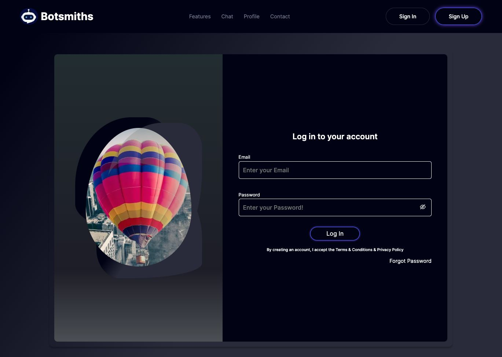
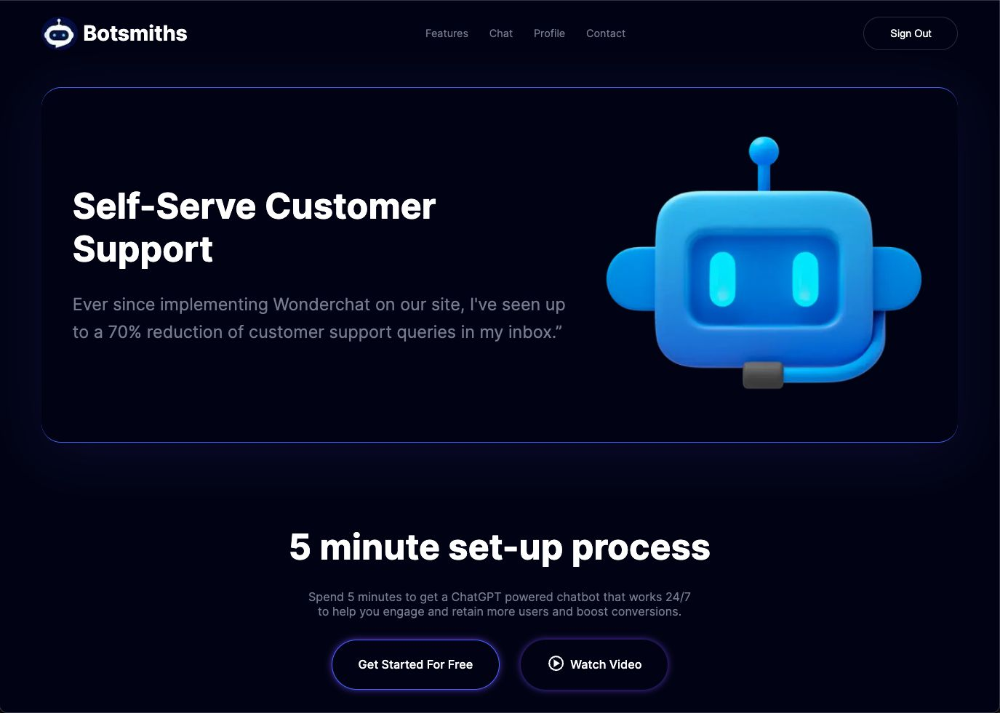
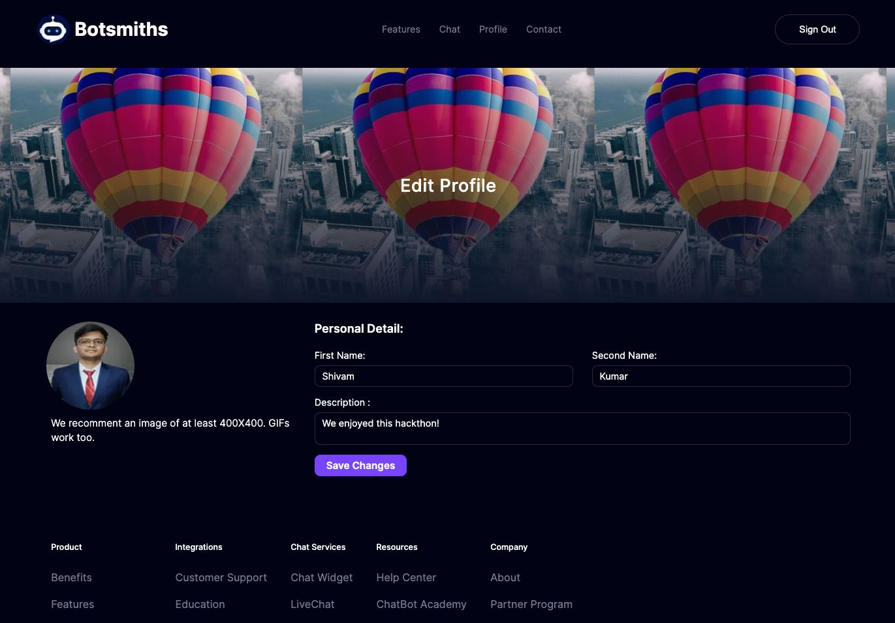
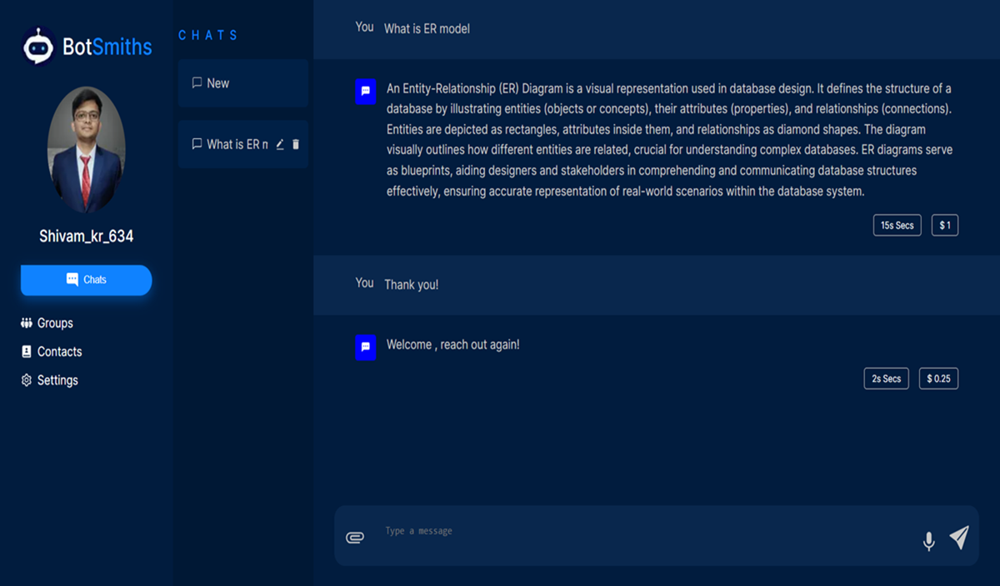
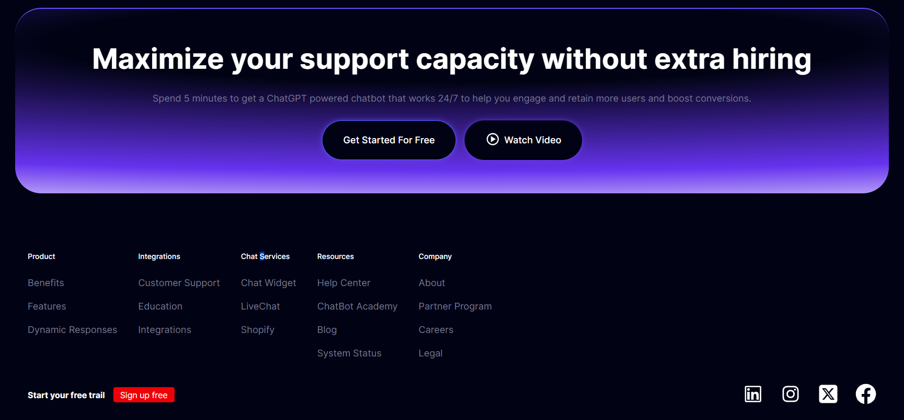

# ChatBot Application Readme

## Overview

Welcome to our ChatBot application! This application is designed to handle various types of inputs including text, PDF files, and audio files. It processes these inputs and provides responses accordingly. The application also includes features such as user authentication, profile management, and different pages like home, login, signup, and forgot password.

## Features

### Input Handling

- **Text Input:** Users can input text messages and receive responses.
- **PDF Input:** Users can upload PDF files, and the application extracts text from them for processing.
- **Audio Input:** Users can upload audio files, and the application transcribes the audio to text for further processing.

### Response Format

The application provides responses in the following format:

```json
{
  "text": "answer",
  "timeTaken": "time_taken",
  "queryCost": "query_cost",
  "messageHistory": "history.chat_summary",
  "title": "history.title"
}
```

## User Pages

1. Home Page: Landing page with general information about the application.
2. Profile Page: Users can view and manage their profiles.
3. Login Page: Allows users to log into their accounts.
4. Signup Page: Allows new users to create an account.
5. Forgot Password Page: Helps users recover their forgotten passwords.
6. Chat Pare : Allows new users to uplaod pdf and ask douts.

## User Authentication

The application implements secure user authentication using Next.js authentication methods.

### Backend Technologies

- Database: MongoDB is used as the backend database for storing user information and chat history.
- Backend Languages: The application backend is developed using Python and Node.js for efficient processing and seamless integration.

## Getting Started

### Prerequisites

1. Install Python: Python Installation Guide
2. Install Node.js: Node.js Installation Guide
3. Install MongoDB: MongoDB Installation Guide

## Installation Steps

1. Clone the repository: git clone <https://github.com/Sar2580P/XR-Vizion-Botsmiths.git>
2. Install dependencies:
   ```cd chatbot-application
        npm install
   ```
3. Configure MongoDB: Set up a MongoDB database and update the connection details in the application.
4. Running the Application

   - Start the backend server:

   ```cd backend
   npm start
   ```

   - Start the frontend server:

   ```
   cd frontend
   npm start
   ```

   - Access the application in your browser: http://localhost:3000

## Usage

1. Text Input: Enter your text query in the provided text box and click on the submit button to receive a response.

2. PDF Input: Click on the "Upload PDF" button, select a PDF file, and click on the submit button to process the PDF and receive a response.

3. Audio Input: Click on the "Upload Audio" button, select an audio file, and click on the submit button to transcribe the audio to text and receive a response.

4. User Authentication: Use the login and signup pages to create an account or log in. If you forget your password, you can reset it using the "Forgot Password" page.

## Snapshot

### SignIn Page



### Home Page



### Profile Page



### Chat Page



### Footer Page



## Contribution Guidelines

We welcome contributions from the community! If you have any ideas for improvement or find any issues, please feel free to create a pull request or report the issue in the repository.

## License

This ChatBot application is licensed under the MIT License.

#### Thank you for using our ChatBot application! If you have any questions or need further assistance, feel free to contact us. Happy chatting!
